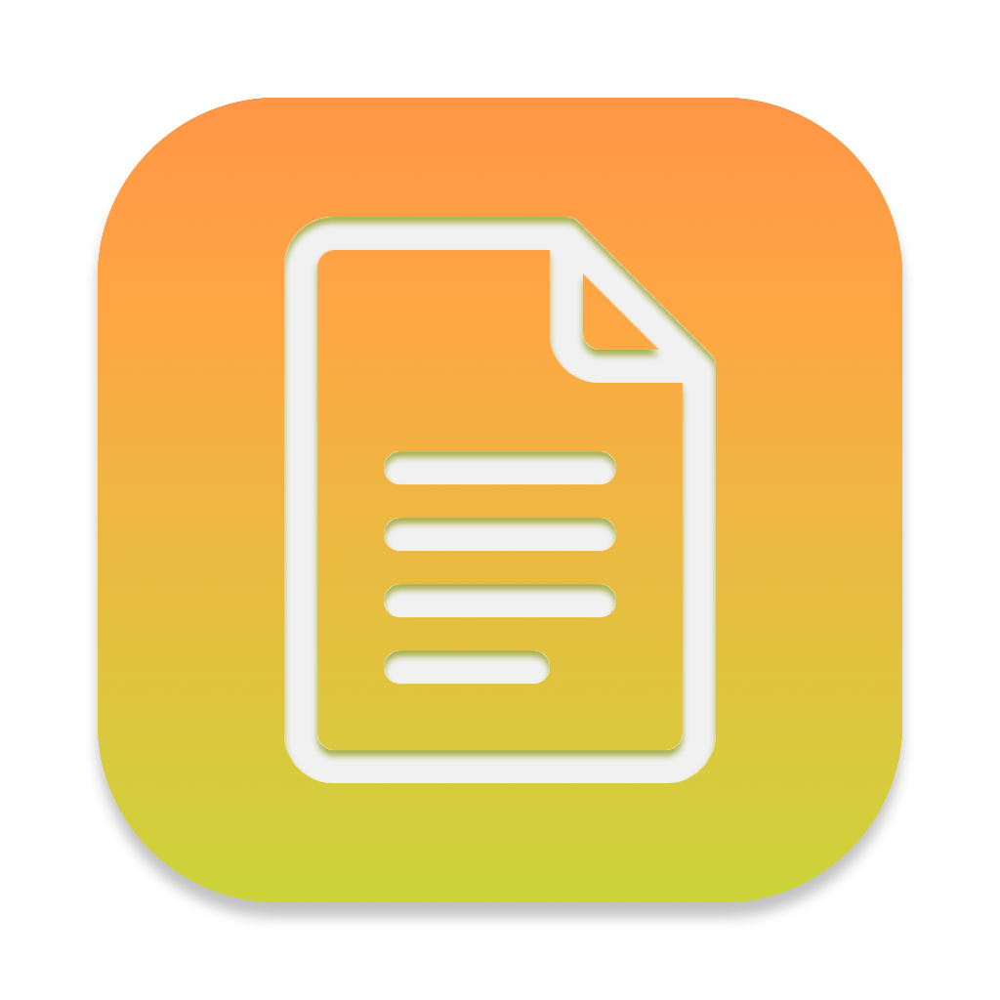

 

  
  

  <h3 align="center">OrdnerMeister</h3>

  

    An app that helps you sort PDF files into your existing folder structure using a Naive Bayes classifier.
     
    <a href="#">View Blog Post</a>
  

## Features

Automatically sort PDF files into your existing folder structure using a Naive Bayes classifier. OrdnerMeister will learn from your existing folder structure and use this knowledge to classify new PDF files. The app will show you the results of the classification process and allow you to move the files to the correct folders. If the PDF has not been OCR'd yet, OrdnerMeister will do this for you using Apple's Vision framework.

## TODO

- [ ] A nicer UI which shows the progress.
- [ ] More options for the user to customize the classification process.
- [ ] Support for more file types.
- [ ] Error handling.
- [ ] Automatic monitoring of the input folder for new files.

## Usage

1. Launch the OrdnerMeister app.
2. In the Settings: Select the folder containing the PDF files you want to sort.
2. In the Settings: Select the output folder where the sorted PDF files should be moved to.
3. Click the "Run" button to start the classification and sorting process.
4. OrdnerMeister will show you the results of the classification process.

## Contributing

Contributions are welcome! If you have any ideas, suggestions, or bug reports, please open an issue or submit a pull request.

## Thanks

- https://github.com/fcanas/Bayes